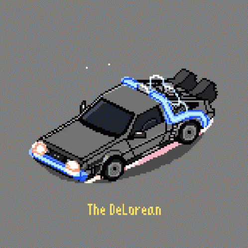

# DeLorean Birthday!

<p align="center">
    
</p>

Uma experiência única de felicitações inspirada no icônico DeLorean do filme "De Volta para o Futuro".

## Como Usar?

É simples! Basta criar um link com seus parâmetros:

```bash
https://happy-delorean/index.html? nome=SeuNome &titulo=Feliz%20Aniversário! &mensagem=Tenha%20um%20dia%20incrível!
```

Sempre após o parâmetro, insira "&".

## Parâmetros:

- 🎯 **nome**: Nome do aniversariante
- 📝 **titulo**: Título da mensagem
- 💌 **mensagem**: Sua mensagem especial

> [!TIP]
> Use `%20` para espaços na URL.